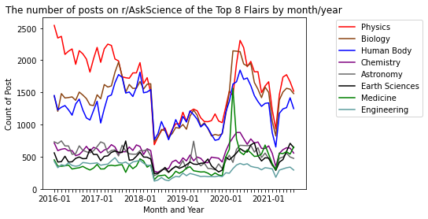
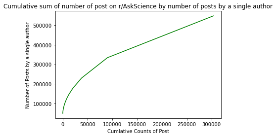

# Choosing Reddit Flairs on r/AskScience

Reddit had an estimated 303.4 million (https://www.redditinc.com/blog/reddits-2020-year-in-review/) new posts in 2020. It is a social media platform with growing popularity and with that comes better need for structure and organization of the platform. Some Subreddits including r/AskScience use a manual flair method where a mod will assign a topic to a post in order to make organizing, filter and search of the subreddits easier. The goal of the project will be to determine if the current flair system implemented in the subreddit r/AskScience is succeeding, can it be improved and if auto flair detection and assignment could be possible. Beyond this we will try to better understand reddit and r/AskScience as a community. The data that will be examined is post data from r/AskScience from Jan. 1st, 2016, and May 31st, 2021 

First lets try to understand the subreddit as whole.

<h3>What Flairs are used now?</h3>

There are 62 unique flairs in total, of which 42 have been used less than 5 times and 8 of which are used less than 10,000 times. Many are AMA based and some are a mix of multiple science fields. A few of the middle to less used flair are listed below to the left to gain a sense of what their scope and prevalence looks like. 

 
The majority of posts, however, can be seen in these top flairs in the pie chart on the right. We will ignore the less used flairs for the purpose of this research as many are simply not used enough to be relevant 

<pre>
...
Earth Sciences             31542 posts
Medicine                   26698 posts 
Engineering                21112 posts
Psychology                 18921 posts
Neuroscience               18517 posts
COVID-19                   16172 posts
Planetary Sci.             15125 posts
Computing                  10297 posts
Mathematics                9360 posts
Social Science             5355 posts
Anthropology               3374 posts
Paleontology               2712 posts
Linguistics                2115 posts
Economics                  2007 posts
Political Science          1122 posts
Archaeology                978 posts
Economics                  2007 posts
Political Science          1122 posts
Archaeology                978 posts
Biology/Agriculture        5 posts
Neuroscience AMA           3 posts
Agriculture                2 posts
Panel Applications         2 posts 
ACS AMA                    2 posts
Malaria AMA                2 posts
Weather ❄ 😎              1 posts 
Neutrino Physics AMA       1 posts
...
</pre>

 

<h3>How has the subreddit change over time?</h3>
Looking at the number of posts over time, the subreddit lost a lot of popularity in 2018 and 2019, but then gained a resurgence in 2020 and is maintaining the popularity in 2021. 

 

The huge spike in popularity coincides with lockdowns starting to occur in North America in early to mid 2020. This would suggest like a lot of internet-based media r/AskScience saw a huge boost in activity from covd-19 lockdown. We even see a new flair COVID-19 popup in 2019 and quickly rise to 3% all time popularity in less than 2 years 

Looking at the topmost used flairs we see a surprisingly consistent pattern between distribution of flair types over time. Flairs tend to fall and grow at the same time 
but also maintain close to the same relative popularity. We see almost two groups in the top flairs, the 'dominant flairs' Physics, Biology and Human Body which maintain them 
top 3 status and are close together, and then the second group of a wide variety of topics like Chemistry, Engineering, and Astronomy which maintain a 'middle tier' group which 
all stay roughly together with neither group really jumping between. 

There is a noteworthy spike from medicine in 2020 which breaks this pattern which is likely due to the sudden public interest in covid's health measures and the vaccine. This 
demonstrates that although the subreddit is relatively set in its ways, massive events like the corona virus can be reflect in large scale change in the behavior of the subreddit. 

 
<h3> What do user patterns look like?</h3>

 

Looking at the correlation between types of posts (based on flair) by user we see specific flair grouping which tend to be posted by the same person are biology, earth science and engineering. Physics also seems to be uniquely separate from the other flairs not having high correlation with any other flair. Biology has the highest correlation with every other flair, which makes sense from the most widely used flair and we also see a tight correlation between engineering, earth science and biology 

 
 
 
 

  
    
  
  
  
  
  
  
  
  
  
  
  
  
  

  

From the graph on the left we see that although some people do post more than just a few times, more than half the submissions on the subreddit come from one or two time posters
and less than 5% come from people who post more than 5 times. 

 

  Alternatively on the right graph we see an overwhelmingly large portion of posts will have less than 50 score, and very few will achieve over 500

 

<h3>How well are topics organized now??</h3>

In order to answer this question, we will try to use topic modelling to create topics based on the questions asked, and see if the currents flairs meet these topics and if the
flairs can easily be predicted based on the question. 

First, we will take the raw question data and remove any stop words/uninformative wards, punctuation/non alpha characters, and lowercase everything. Stemming was applied but found not significant predicative improvements. This will be our corpus for analysis. For the purpose of analysis we will only look at the top 8 flairs, for easy of analysis and computation, but also all lower flairs are only used less than 4% of the time  
 

 

 

 
 

Next lets examine the top 8 flairs word clouds to better understand the words and scope of each flair
 

 

We see that each flair has pretty distinct words that coincide with that branch of science, however some words overlap. For example 'earth' is used in astronomy and earth sciences and physics, 'human' is a common word between human body, medicine, and biology.  
 

  'Energy','earth','work', 'light' are all terms used in both physics and engineering. This suggests these topics are indeed very similar in subject matter, however they do have some distinction as well 
 

 
 

Next, split the data into training/validation and test. TFIDF is then fitted and applied and then passed through both Multinomial Naive Bayes classifier and a Linear Support Vector Classifier, which is then fined tuned with the validation set and applied to the test set
 

We see the accuracy of MultinomialNB is 0.65 and LinearSVC 0.668
 

 

Looking at the confusion matrix of the LinearSVC model we can analyze topics which the model could easily predict, and which it had trouble distinguishing. 

We see high similarity by the predictor between Biology and Human Body in both directions which makes sense since they have similar domains. 
 

Human body is more than twice as likely to be mistaken for medicine, compared to biology to be mistake for medicine. We also see engineering posts are often predicted to be physics posts, whereas physics posts are not so often mislabeled as engineering We also see most other flairs are often mislabeled as Physics flairs These results suggest that prehaps Biology and Human Body flairs could be combined. 
 

The problem with this is that these two flairs are already among the biggest flairs, so it is possible the very close similarity is endured to maintain slightly between distinction between the posts
 

 

The commonalities between the misclassification is reflected in the similarity of the confusion matrix of our classifier and the previous word clouds. 
 

 

<h3>Can we do better?</h3>

In order to test whether or not their are better flairs we can try to use topic modelling on the posts of the top 8 flairs
 

Using a matrix of word counts from the training set LatentDirichletAllocation (LDA) is used to determine weights for each new topic. Taking each of the top words
manually for 8 topics, labels where assigned:
 

 

Looking at the new topics we see a lot of the existing topics clearly from the word clouds. Chemistry, Physics, AstroPhysics/Astronomy, Chemistry and Earth Sciences. We also have some word clouds that are a bit ambiguous like Medicine, Human Body and Biology. None of these seem like perfect fits but are the best approximations of the words. 
 

 

  Zoology is a new topics which is now seen. It has words specific to studying animals(including humans): Plants, hair, evolutionary, species, dogs, animals.

 
 

 

<h3>Next steps?</h3>

Given more time, I think the next natural step would be to include this new topic of Zoology and relabel posts from the subreddit and try to rerun a topic classification prediction model on the new data and see if it performs better. Naturally using only models to verify how well these topics are labelled has very little external validity so having manual labelers and validators would be ideal once our model is able to easily determine the distinction in topics 
 

 
   
  
  
    
  
  
